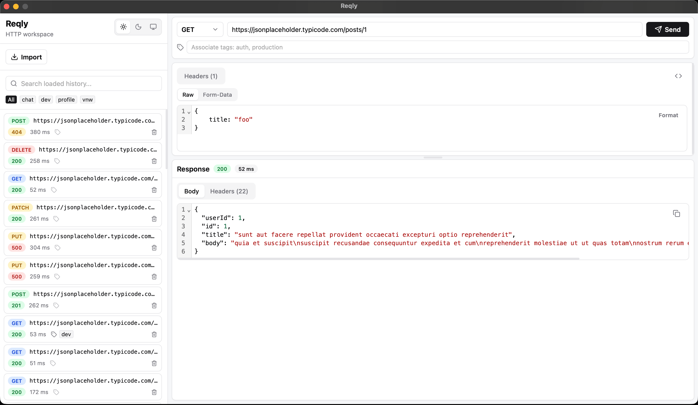
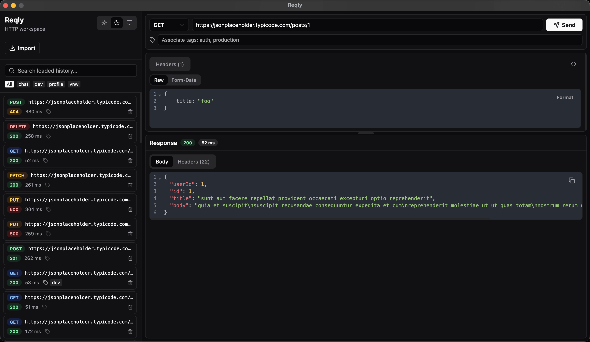

<div align="center">
  <h1>🚀 Reqly</h1>
  <p><strong>A lightning-fast, privacy-first desktop REST API client.</strong></p>
  <p>
    <a href="https://wails.io">
      
    </a>
    <a href="https://react.dev">
      
    </a>
    <a href="https://opensource.org/licenses/MIT">
      
    </a>
  </p>
</div>

---

**Reqly** is a beautifully designed, lightweight desktop application built for developers who need a distraction-free way to interact with HTTP APIs. Say goodbye to bloated interfaces and cloud-sync privacy concerns.
## 📸 Screenshots

<p align="center">
  
  
</p>

## ✨ Core Principles

1. 🔒 **Data Safe & Private** — Your API keys, tokens, and data stay strictly on your local machine. Nothing is ever sent to 3rd party cloud servers.
2. ⚡ **Just Call HTTP** — A minimal, clean, and intuitive interface designed to execute requests without getting in your way.
3. 📜 **History & Re-run** — Automatically save your request history and click to re-run past requests instantly.
4. 🏷️ **Tags for Filtering** — Organize your workflows with custom tags and filter your history blazingly fast.
5. 📥 **Parse Import** — Paste pure `cURL` commands or `.http` entries, and Reqly will parse them right into the builder.

## 🛠 Tech Stack

Reqly is built using the highly performant **Wails v2** framework, combining the power of Go with a modern web frontend.

- **Desktop Shell:** Wails v2 (Native OS windows)
- **Backend:** Go 1.25 + standard `net/http` engine
- **Database:** Local SQLite (`mattn/go-sqlite3`)
- **Frontend:** React 19, TypeScript, Vite
- **Code Editor:** CodeMirror 6 with beautiful syntax highlighting

## 🚀 Getting Started

### Prerequisites

- [Go](https://golang.org/doc/install) 1.25 or newer
- [Node.js](https://nodejs.org/) & npm
- [Wails CLI](https://wails.io/docs/gettingstarted/installation)

### Live Development

To run the application in live development mode with hot-reloading:

```bash
# Start the Wails dev server
wails dev
```

If you prefer to debug the frontend in your browser, visit `http://localhost:34115`.

### Building for Production

To package the application into a standalone native executable:

```bash
# Build for your current OS
wails build
```

You will find the generated binary (e.g. `reqly.app` on macOS or `reqly.exe` on Windows) inside the `build/bin/` directory.

## 🤝 Contributing

Contributions, issues, and feature requests are welcome!

## 📄 License

This project is licensed under the [MIT License](LICENSE).
